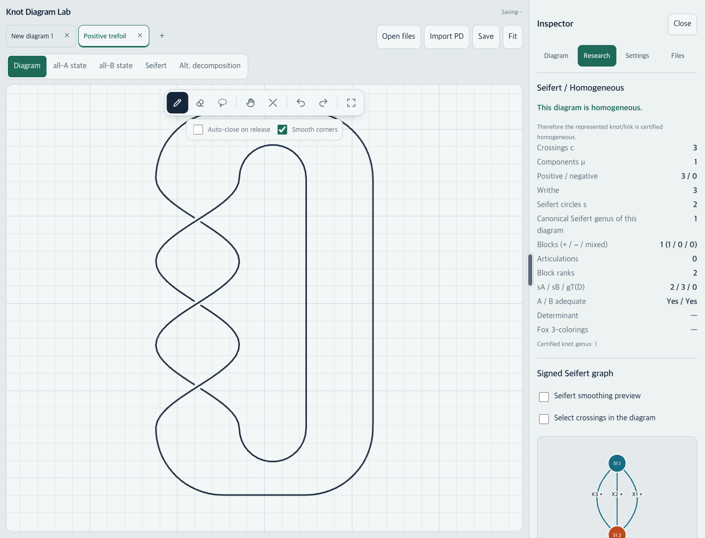
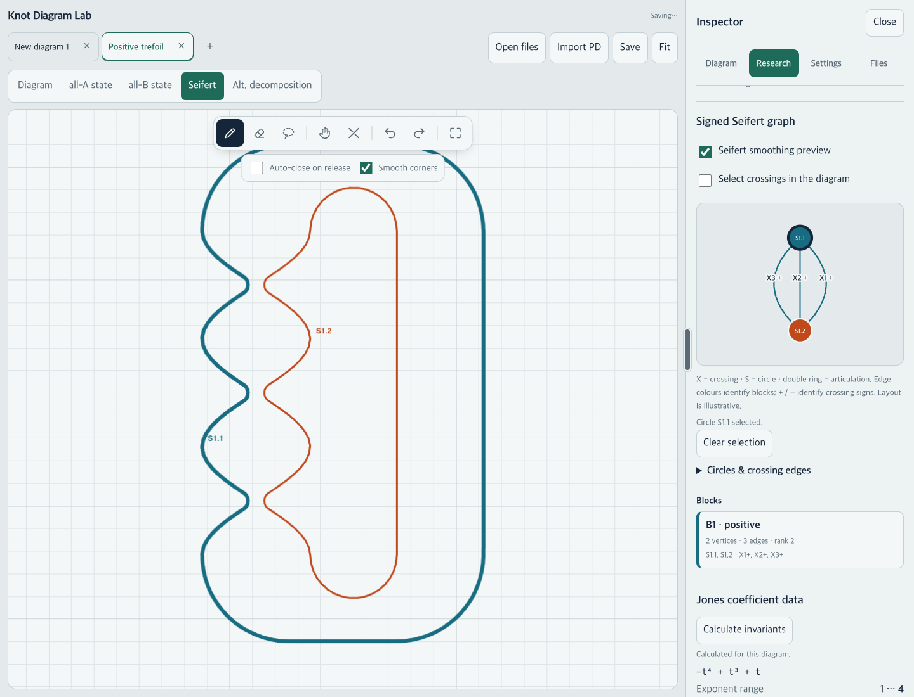

# Seifert / Homogeneous research implementation

Implemented against `5c19e14`, preserving the static app and existing geometry algorithms. Open **Inspector → Research** to analyze a closed diagram, inspect its signed Seifert graph, calculate exact Jones coefficient data, or run a local batch. Mathematical definitions and export fields are documented in [RESEARCH.md](RESEARCH.md); the app includes an [offline guide](dist/research.html).

## Files and algorithms

| Files | Purpose |
| --- | --- |
| `dist/knot-core.js` | Existing inline `KC` core extracted unchanged, verified against the base commit. The editor and batch worker now execute the same geometry, smoothing, crossing reconstruction and PD analysis. |
| `dist/seifert.js` | Trace the directed-arc permutation from existing `Sf` smoothing pairs; validate it; assign circle IDs; retain every original crossing ID and sign in a multigraph. |
| `dist/graph-blocks.js` | Iterative Tarjan edge-stack decomposition, articulation vertices, connected components, bipartite diagnostics, block signs and ranks. Skip only the parent edge, preserving parallel edges. |
| `dist/research-analysis.js` | Canonical-surface genus, homogeneity records, structured exact Jones coefficients, shared polynomial formatting, deterministic JSON/CSV and exact coefficient comparison. |
| `dist/research-dataset.js`, `dist/research-worker.js` | Local input adapters and isolated batch reconstruction/calculation, with row errors, progress and immediate worker termination for cancellation. |
| `dist/research-ui.js`, `dist/research.css`, `dist/index.html` | Inspector, graph/circle/crossing/block selection, existing smoothing preview, statistics, worker controls, sortable/filterable paginated batch table and downloads. |
| `dist/sw.js`, `dist/research.html` | Cache all required modules and the research guide for offline use. |
| `tests/research.test.cjs`, `tests/research.browser.cjs` | Mathematical tests and an optional real-browser smoke test. |
| Existing test loaders, `tests/app.test.cjs`, `tests/offline.test.cjs`, `.github/workflows/ci.yml` | Load the extracted core; cover UI/state/input/worker regressions and offline assets; run the mathematical research suite in CI. |
| `README.md`, `CHANGELOG.md`, `RESEARCH.md`, this report, `docs/research/` | Usage, definitions, references, implementation evidence and screenshots. |

The research controller receives finalized editor data and view/calculation callbacks. It has no diagram-editing callbacks. Batch rows go through the existing `PDImport.fromPD` geometry generation and crossing verification before analysis. Selection and calculations do not add undo entries.

## Mathematical decisions

- A diagram is homogeneous exactly when every edge block has one sign. Opposite signs in separate blocks are allowed. Bridges are rank-zero dyad blocks; isolated circles have no edge block and satisfy the empty-block test.
- Each block retains its vertices, original crossing edges, signs, counts and rank `E − V + 1`. Self-loops and non-bipartite graphs are diagnostics that suppress certification.
- With `k` canonical-surface components, the sum of genera is `(2k − μ − s + c)/2`. The disconnected case is labeled explicitly. Only a homogeneous **knot** diagram receives the additional knot-genus certificate.
- A failed diagram test never labels the represented knot/link non-homogeneous. `V(t) = 1` is an exact polynomial test, never an unknot certificate.
- Jones data comes from the existing engine's structured terms. Coefficients remain exact decimal strings; exponents use the existing doubled-integer representation. Second coefficients mean the next **occupied** powers. Unavailable data is `null`.

## Validation

All seven Node suites passed locally: moves, PD import, app/input state, exact invariants, offline cache, alternating decomposition and research. Existing Jones normalization fixtures continue to pass; the positive trefoil is `−t⁴ + t³ + t` in this app's convention. The extracted core was also compared directly with the base source and is unchanged.

New mathematical coverage includes:

- All four requested block cases: positive parallel edges, mixed parallel edges, opposite-sign bridge blocks at an articulation and a mixed cycle.
- Isolates, disconnected graphs, duplicate IDs, self-loop/non-bipartite diagnostics, 250 random multigraph comparisons against an independent cycle/cut-vertex oracle, and a 12,000-vertex iterative-DFS case.
- Unknot, positive trefoil, figure-eight, positive `5₁`, genus-3 `T(2,7)`, alternating assignments, mirrors, PD reconstruction, Hopf link, split unlink and exclusion of open arcs. Circle counts agree with existing smoothing; mirrors preserve circle IDs.
- Exact occupied Jones extremes, large coefficients, half-exponents, `V(t) = 1`, unavailable results, deterministic exports and safe CSV names.
- PD/JSON/CSV/TSV adapters, limits, worker progress, optional exact invariants, isolated malformed rows and parity between finalized single and batch analysis.

App tests cover edit/undo restoration, stale/canceled invariant results, tab isolation, hidden-panel editing, read-only selection and isolated batch cancellation. Existing tests continue to cover dragging, Reidemeister moves, crowded crossings, bigons, kinks, relaxation, strand erasing, file round trips and decomposition.

The optional browser test passed in installed Chrome at desktop and 390 × 844 phone sizes. It exercises actual SVG interactions, the real invariant/batch workers, downloaded JSON/CSV files, genus-3 filtering, row-error expansion and batch cancellation. Mouse, touch and pen pointer events exercise both read-only selection and editor movement followed by undo, with semantic state comparisons. No page errors or phone page overflow were observed.

**Input limitation:** these were synthetic pointer events in a real browser, not physical Apple Pencil, touchscreen or mobile Safari trials. Physical device testing remains outstanding. CI configuration includes Node 22/24 on Linux and Node 24 on macOS; this report records local execution, not a claim that remote CI has run.

To reproduce the optional browser check, make `playwright` and Google Chrome available and run `node tests/research.browser.cjs`. `PLAYWRIGHT_MODULE` may point to an existing Playwright installation. Screenshots default to the system temporary directory; set `RESEARCH_SCREENSHOTS` to choose another directory. The seven dependency-free suite commands are listed in [README.md](README.md#tests).

## Sources and current limits

The signed graph/block definitions and minimal-surface statement were checked in [Manchón's journal paper](https://msp.org/pjm/2012/255-2/pjm-v255-n2-p06-p.pdf), also available on [arXiv](https://arxiv.org/abs/1102.0890), which cites [Cromwell's original theorem](https://doi.org/10.1112/jlms/s2-39.3.535). The Cromwell publisher text was inaccessible during this session; it was not independently read in full. The [NetworkX block documentation](https://networkx.org/documentation/stable/reference/algorithms/generated/networkx.algorithms.components.biconnected_components.html) supports the DFS and dyad convention.

[Stoimenow's paper](https://stoimenov.net/stoimeno/homepage/papers/gen2.pdf) and [generator page](https://stoimenov.net/stoimeno/homepage/ptab/) were consulted: 4,017 denotes genus-3 **generators**, not a finite classification of all genus-3 knots. [KnotInfo](https://knotinfo.org/) and its [download page](https://linkinfo.knotinfo.org/homelinks/database_download.php) were inspected as prospective local data sources; no database corpus was imported or cross-checked in this implementation. The requested [Kauffman PDF](https://www.maths.ed.ac.uk/~v1ranick/papers/kauffmanjones.pdf) was inaccessible; the existing engine's [author reference](https://arxiv.org/html/2204.12104v2) was available. No second invariant implementation or normalization was introduced.

Existing computational limits remain: exact Jones at 18 crossings, determinant/coloring at 200, PD import at 80 per row. Batches accept up to 10,000 rows and 5 MB. Native DT/KnotScape/spreadsheet formats require conversion to supported PD records. The application has no runtime dependency on research websites. Circle IDs are stable within a retained diagram's crossing identities, not across arbitrary reimports or Reidemeister moves. Graph coordinates are illustrative; large multigraphs may require scrolling. Research exports are statistics, not replacements for saved diagram files, especially for crossing-free components absent from PD notation.

No unresolved mathematical ambiguity is hidden behind a positive certificate. Unsupported/open/inconsistent states report unavailability or diagnostics. This mode supports experiments and conjecture development; it does not decide knot equivalence or prove Jones detection of the unknot.

## Research UI

Statistics and the separate canonical/certified genus language:

Circle selection reuses the existing Seifert smoothing; parallel signed edges and the block remain separately visible:

[Batch filters and results](docs/research/research-batch.png) · [Phone layout](docs/research/research-phone.png)
